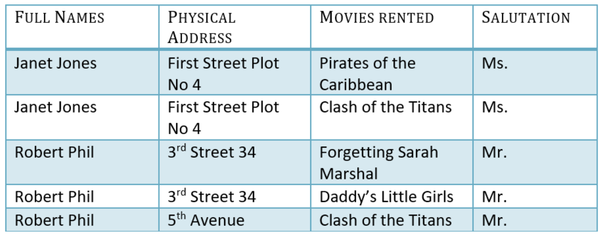
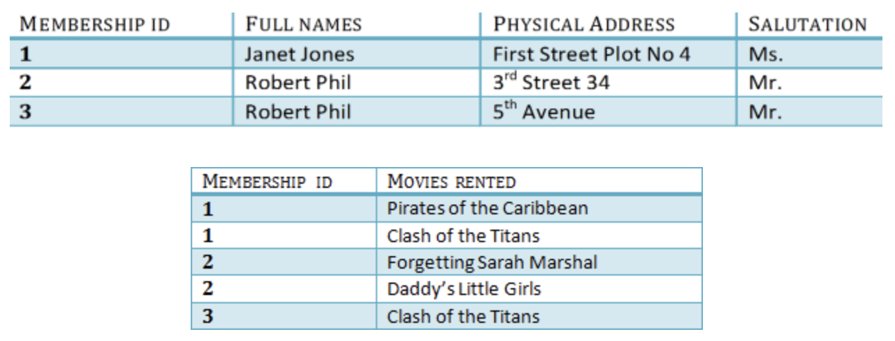
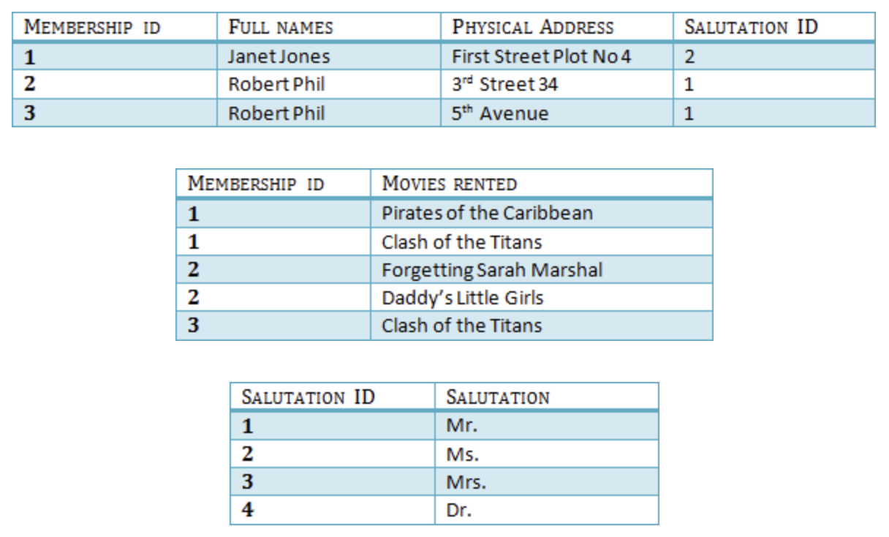

# Database Normalization example

Database Normalization Example can be easily understood with the help of a case study. Assume, a video library maintains a database of movies rented out. Without any normalization in database, all information is stored in one table as shown below. Let’s understand Normalization database with normalization example with solution.

## 1NF (First Normal Form) Rules
* Each table cell should contain a single value.
* Each record needs to be unique.

## 2NF (Second Normal Form) Rules

* Rule 1 - Be in 1NF
* Rule 2 - Single Column Primary Key that does not functionally dependant on any subset of candidate key relation

We have divided our 1NF table into two tables viz. Table 1 and Table2. Table 1 contains member information. Table 2 contains information on movies rented.

## 3NF (Third Normal Form) Rules

Rule 1 - Be in 2NF
Rule 2 - Has no transitive functional dependencies

We have again divided our tables and created a new table which stores Salutations.

There are no transitive **functional dependencies**, and hence our table is in 3NF

A transitive functional dependency is when changing a non-key column, might cause any of the other non-key columns to change

[More about normalization](https://www.guru99.com/database-normalization.html)
