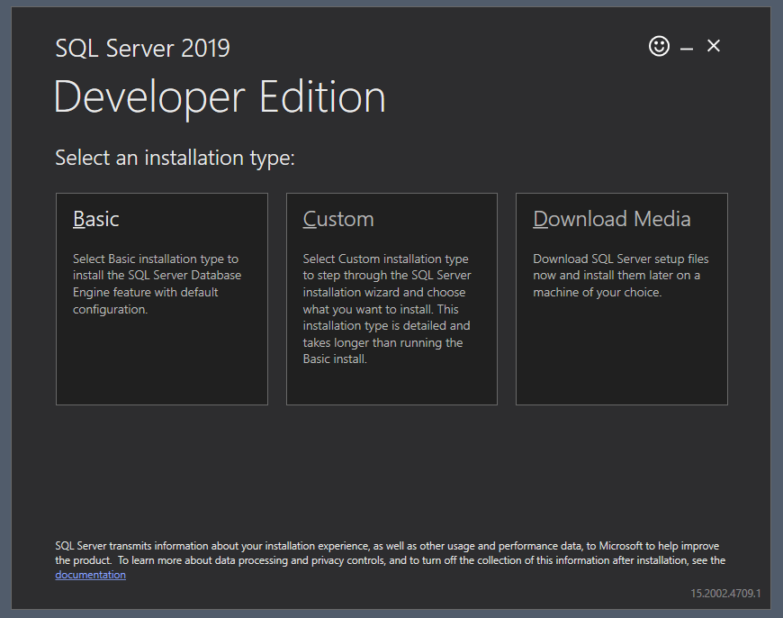

# Let's set up MSSQL

* Download MSSQL 2019 developer edition: [https://www.microsoft.com/en-us/sql-server/sql-server-downloads](https://www.microsoft.com/en-us/sql-server/sql-server-downloads)
* Double click on downloaded file.
* Select basic set up:

---

---

---

* After success set up, select install SSMS in dialog and you will be redirected to page for downloading SQL Server Managment Studio ([https://aka.ms/ssmsfullsetup](https://aka.ms/ssmsfullsetup)):

  
* Double click on downloaded file and install SSMS
* Press 'Connect Now' to be sure that it is possible to connect to database:

