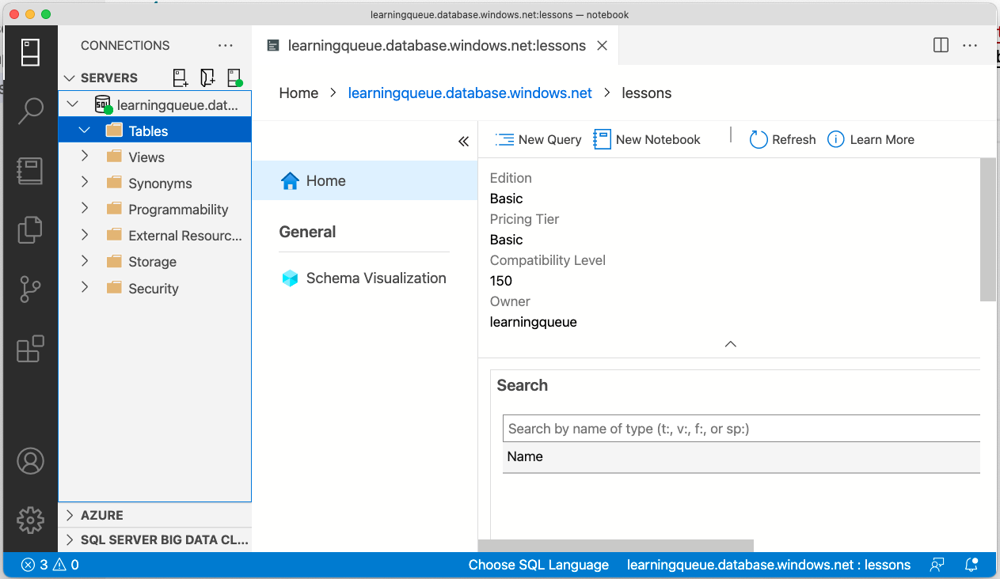
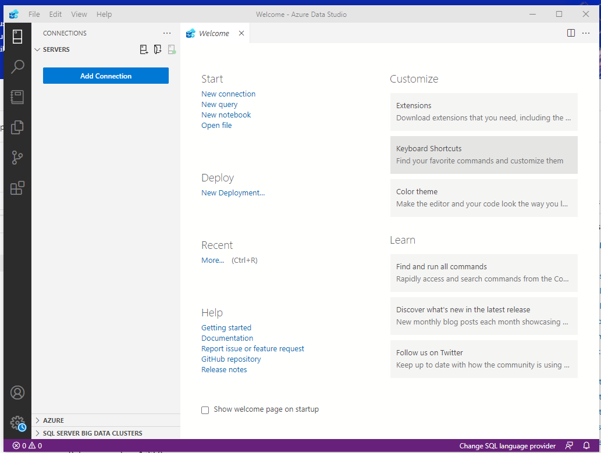
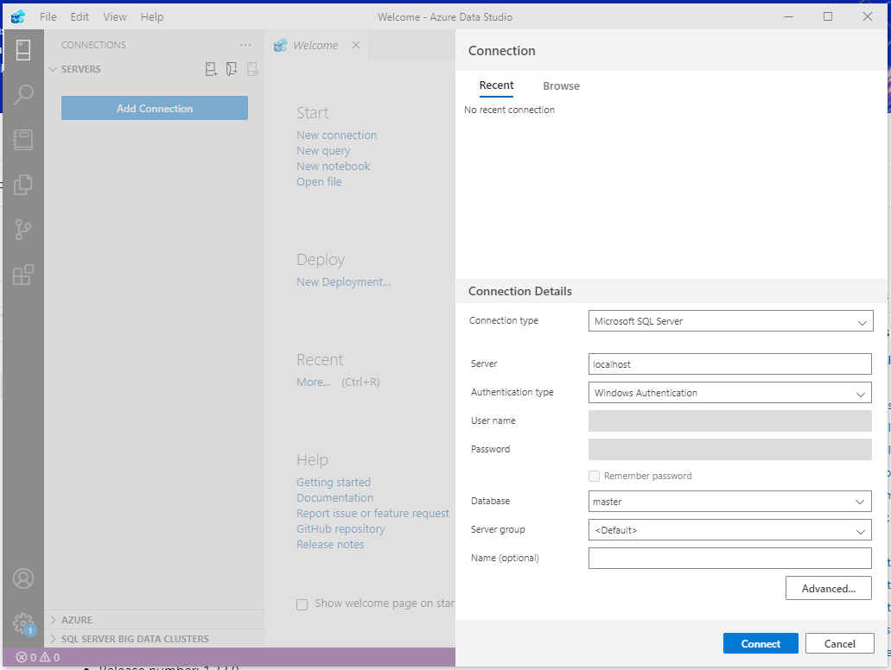
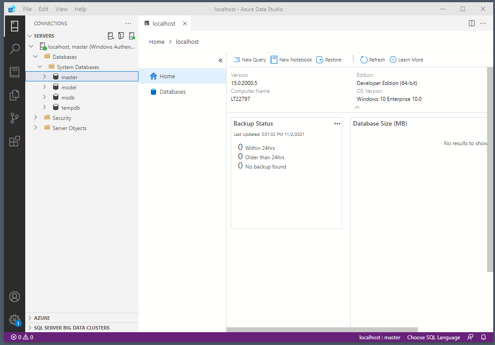

# Let's set up tools

* The easiest way to work with MSSQL is to use MSSQL SSMS (installed before) or Azure Data Studio.

* Let's set up **Azure Data Studio** ([https://docs.microsoft.com/en-gb/sql/azure-data-studio/download-azure-data-studio?view=sql-server-ver15](https://docs.microsoft.com/en-gb/sql/azure-data-studio/download-azure-data-studio?view=sql-server-ver15)):

* Let's connet to our database:

---

---

