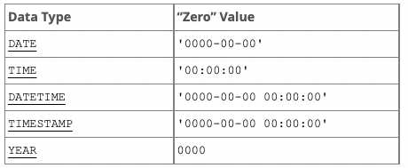

# Working with date and time data

MySQL supports 5 date and time data types:



Let's look at example:

```sql
SELECT orderid, custid, empid, orderdate
FROM Orders
WHERE orderdate = '20160212';
```

SQL Server recognizes the literal ‘20160212’ as a character-string literal and not as a date and time literal, but because the expression involves operands of two different types, one operand needs to be implicitly converted to the other's type.

Casting is done implicitly here, but we can specify it by using *CAST*

```sql
SELECT orderid, custid, empid, orderdate
FROM Sales.Orders
WHERE orderdate = CAST('20160212' AS DATE);
```

We can also use CONVERT:

```sql
SELECT CONVERT('14:06:10', TIME);
```

## Date and time functions

[link](https://mariadb.com/kb/en/date-time-functions/)

```sql
SELECT
  CURDATE()           AS `CURDATE`,
  CURRENT_TIMESTAMP   AS `CURRENT_TIMESTAMP`,
  CURRENT_TIME        AS `CURRENT_TIME`;
```
